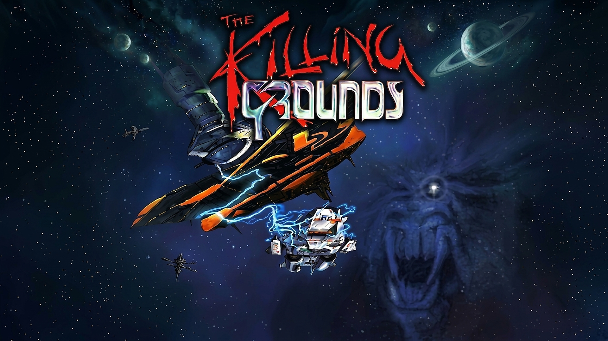

# Alien Breed 3D II: The Killing Grounds — Java Port



A **faithful Java port** of the *Alien Breed 3D II: The Killing Grounds* engine (Team17, Amiga,
1996), from the original 68k assembly and C. A **line-by-line** rewrite, no emulator, running
natively on PC through LWJGL 3.

> Ported by **Guillaume Monet**, with Claude's assistance.

*[Version française](README_FR.md)*


*Level A, drawn by the ported original engine — 320×256, just as on the Amiga.*

---

## 1. Approach

The original engine is written in 68000/68020/68060 assembly and C, and targets Amiga hardware
(custom chips, blitter, copper, Paula audio, chunky→planar "C2P" conversion). This project
rewrites it **line by line** in Java, without approximation:

- **Flat big-endian memory** — a single `byte[] Mem.RAM` (64 MB) emulates the 68k RAM. Every
  access goes through typed helpers (`Mem.b/w/l`, `Mem.ub/uw`, `Mem.wb/ww/wl`…) that reproduce
  the byte order and the 68k's arithmetic. Registers `d0-d7`/`a0-a6` become `int`.
- **68k helpers** — `M68k` (`swap`, `muls/mulu`, `divs/divu`, `asrw`, sign extensions…)
  reproduces the CPU's idioms, including its traps: `divs.w` returns
  `(remainder << 16) | quotient`, and dropping that remainder once cost an entire AI bug.
- **Targeting 68060 + RTG** — only the fastest CPU branch and the *chunky* display are ported.
  CPU/resolution variants and the **C2P conversion are deliberately left out**: the engine
  renders straight into a chunky buffer that the host presents.
- **LWJGL 3 host layer** (GLFW / OpenGL / OpenAL) — replaces the Amiga custom chips for display,
  game loop, keyboard/mouse input and audio.
- **Two engines, one simulation** — see §2.

### What is ported

- Real-time 3D level rendering (textured walls, floors/ceilings, lighting, gouraud).
- Objects/sprites, aliens and their AI, weapons and firing, pickups, doors/lifts/switches.
- Textured HUD, in-game messages, automap.
- Audio: music (ProTracker) plus sound effects (software mixing in Paula's style).
- **Complete menu**: animated fire screen, navigation, options/controls submenus, save/load,
  sliders and cyclers, persisted preferences.
- **Narrative intro text** for every level (proportional font, faithful rendering).
- Teleport transition and end-of-level music.

### Known limitations

- **Two-player mode** unavailable (the Amiga serial link is not ported; a local TCP mode is
  planned — see §8).
- Development platform: **Windows x64** (LWJGL `natives-windows`).

---

## 2. The full-3D remake, elsewhere

This repository holds the **faithful port** only: the line-by-line translation of the original
engine, which remains the one complete and exact version.

The **full-3D** remake on jMonkeyEngine is a project of its own:
**[ab3d2-tkg-rebirth](https://github.com/guillaumemonet/ab3d2-tkg-rebirth)**. It is not another port but another engine — it rebuilds the levels in
true 3D and replays the same game logic. It leans on this repository in two ways:

- as the authoritative **reader** of the original formats, to extract the assets;
- as the **oracle**: whenever the remake's behaviour looks wrong, it is settled against this port,
  by instrumenting both and diffing the traces.

This repository does not depend on it: it builds and runs on its own.

## 3. The data: the floppies, and nothing else

**No game asset is versioned here**, and the redistributable build embeds none either. The only
source is the set of five `.adf` disk images, in an `adf/` folder.

If they are missing, the game **offers to download them** from
[Dream17](https://dream17.abime.net), the preservation site for Team17's Amiga catalogue (a ZIP
of about 3.4 MB). Nothing is downloaded without an explicit yes. It then mounts the disks,
unpacks whatever needs unpacking and writes a cache; afterwards it just reads that cache.

```bash
gradle -p java fetchDisks    # fetch the floppies by hand
```

`-Dab3d2.adfUrl=…` changes the source, `-Dab3d2.noDownload` disables the prompt.

```
ab3d2-tkg-new/
├── ab3d2-tkg/        original ASM/C sources (mheyer32/alienbreed3d2 repository)
├── adf/              the five floppies — THE asset source
├── medias/original/  extraction cache (regenerated, never versioned)
└── ab3d2-tkg-java/
    ├── assets/       modern assets produced by `extract` (regenerable)
    └── java/         ← THIS REPOSITORY
```

### The `=SB=` format

The files on the floppies are compressed. `io_LoadFile` (`modules/file_io.s`) branches on the
magic `'=SB='` and calls `unLHA`, which is nothing but an `incbin "decomp4.raw"` — 2508 bytes of
68k code, the very same blob embedded in the 1997 `SBDepack` tool.

| offset | size | contents |
| --- | --- | --- |
| 0 | 4 | magic `=SB=` (`$3D53423D`) |
| 4 | 4 | **unpacked** size |
| 8 | 4 | **packed** size |
| 12 | … | compressed stream |

`SBDepack`'s strings advertise "*Decrunch algorithm by Team 17*", which first sent me looking for
an in-house format. That is wrong: disassembling `decomp4.raw` shows the exact sequence from
`huf.c`,

```
07d4: moveq #$13,d1 ; moveq #$5,d0 ; moveq #$3,d2 ; bsr $344   -> read_pt_len(NT=19, TBIT=5, 3)
07de: bsr $4f0                                                 -> read_c_len()
07e2: move.w np,d1 ; moveq #$4,d0 ; cmp.w #$10,d1 ; blt ; addq #1,d0
07f2: bsr $344                                                 -> read_pt_len(np, pbit, -1)
```

that is, **LHA**. The blob has two entry points differing only by `np`:

```
01a0: move.w #$1fe,NC ; move.w #$e ,np    ; np=14 -> dicbit 13 (-lh5-)
01b0: move.w #$1fe,NC ; move.w #$10,np    ; np=16 -> dicbit 15 (-lh6-)
```

and the game calls **the second one**. So it is `-lh6-`, a 32 KB window — decoded as `-lh5-` the
stream falls apart on the very first block, which is exactly what had misled me.

Ported in `host/SbDepack.java`, together with `host/Adf.java` (OFS/FFS reading) and
`host/AdfAssets.java` (mounting). **Validation**: 430 files across the floppies, 313 packed,
**313 decoded without a single error**, zero content mismatch against an already-unpacked
reference corpus.

```bash
gradle -p java adfCheck    # validates unpacking (must print PASS)
gradle -p java depack      # forces the cache to be rebuilt
```

### Which floppies

The target is the **4 MB** version, so three disks are enough: **3** (4 MB boot), **2** (levels
A–P) and **5** (sounds). Disk 1 is the 2 MB boot — its variants differ and are poorer — and disk
4 is the editor. Mount order matters: since AmigaDOS is case-insensitive, `/includes` and
`/Includes` are **the same** directory, and without merging them the 4 MB variant never overrides
the 2 MB one.

### The `incbin` files

Twenty-one of the engine's twenty-two `incbin` files are on **no** floppy and are referenced
nowhere in `test.lnk` (the GLF database): rasteriser tables (`bigsine`, `iterfile`, `guff`,
`waterfile`, `shimmerfile`), fonts and digits, the screen border, the menu screen, and the two
end-of-game ProTracker modules. That is expected — the assembler folded them **into the binary**,
they were never shipped as files. They are therefore part of the *program*, not of the game data,
and are versioned here under `resources/incbin/` (300 KB).

Only `256pal` comes from the floppies; `includes/newtitlepal` exists nowhere and stays missing.

---

## 4. Requirements

| Component | Version |
| --- | --- |
| **JDK** | 21 (Gradle toolchain set to Java 21) |
| **Gradle** | 9.x |
| **OS** | Windows x64 (LWJGL `natives-windows`) |
| **GPU** | OpenGL |
| **Data** | the game's five `.adf` images, in an `adf/` folder |

The LWJGL dependencies (GLFW, OpenGL, OpenAL) are fetched from Maven Central on the first build.

---

## 5. Project layout

```
java/                       ← repository root
├── README.md             this file (English)
├── README_FR.md          version française
├── build.gradle
├── docs/                   architecture and porting notes (PORT_SUBSYS_*, PVS.md)
├── resources/incbin/       the incbin files linked into the original binary (see §3)
├── run/                    written at runtime (preferences, saves, log)
└── src/ab3d2/
    ├── *.java              engine core (Hires, Controlloop, Plr*control, Objdraw…)
    ├── c/                  port of the C files (ScreenC, DrawC, MenuC, GameC…)
    ├── modules/            subsystems (Player, Res, FileIo, RawKeyMacros…)
    ├── data/               initialised data sections (tables, fonts, menus)
    ├── bss/                BSS sections (buffers, KeyMap…)
    ├── menu/               menu engine (Menunb)
    ├── host/               LWJGL layer, floppy reading, =SB= unpacking
    └── tools/              tooling (CheckLayout, AdfCheck, Depack, SkyDump)
```

---

## 6. Building & running

```bash
gradle -p java run             # the game
gradle -p java compileJava
```

### Redistributable build (Windows)

Produces a **portable app-image**: a self-contained folder with the executable and a **bundled
JRE**, and *no game data whatsoever*.

```bash
gradle -p java packageApp
```

Result: `java/build/jpackage/AlienBreed3D2-TKG/` — run `AlienBreed3D2-TKG.exe`. The folder can be
moved anywhere: paths are resolved relative to the executable.

```
AlienBreed3D2-TKG/
├── AlienBreed3D2-TKG.exe
├── LISEZMOI.txt
├── adf/        the floppies (empty to begin with)
├── app/        the jars
├── run/        settings and saves
└── runtime/    the bundled JRE
```

On **first launch** the game notices the data is missing and offers to download the floppies; it
then unpacks them by itself into `medias/`. Since nothing belonging to Team17 is redistributed,
the package can be passed around as-is.

### Diagnostics (freezes / logs)

The app-image has no console: `Main` redirects `stdout`/`stderr` to `<App>/run/ab3d2.log`. On a
freeze, a *watchdog* dumps every thread's stack after 5 s without a frame (look for `"main"`).

- `-Dab3d2.watchdogMs=N` — threshold (`0` disables); `-Dab3d2.log=path` (`off` keeps the console).
- `-Dab3d2.assets=…` forces the asset root, `-Dab3d2.adf=…` the floppy folder.

### Checking the port's integrity

```bash
gradle -p java checkLayout    # memory layout — must print "TOUT OK"
gradle -p java adfCheck       # floppy unpacking — must print PASS
```

---

## 7. Controls

Remappable in Options › Controls.

| Key | Action |
| --- | --- |
| `W` / `S` | Forward / Backward |
| `←` / `→` | Turn left / right |
| `A` / `D` | Strafe left / right |
| `Ctrl` | Fire |
| `F` | Operate (doors, switches) |
| Left `Shift` | Run |
| Left `Alt` | Force strafe |
| `C` / `Space` | Crouch / Jump |
| `=` / `-` / `;` | Look up / down / centre |
| `L` | Look behind |
| `\` , `1`…`9`,`0` | Next weapon, direct selection |
| `Esc` / `P` / `Tab` | Leave level / Pause / Map |
| `F7` / `F10` | FPS limit / Fullscreen |

> Key mapping is **physical** (the host's `W` → `RAWKEY_W`); the game's own bindings are then
> applied to those rawkeys by the engine, exactly as on the Amiga.

---

## 8. Status

| Subsystem | Status |
| --- | --- |
| `Mem` / `M68k` / `Assets` infrastructure | ✅ `gradle checkLayout` prints "TOUT OK" |
| Rendering: walls, floors/ceilings, gouraud, PVS | ✅ `gradle levelTest` |
| Objects, sprites, vector models | ✅ |
| Aliens: AI, animation, line of sight, damage | ✅ `gradle alienTest` |
| Player: movement, collision, abilities | ✅ `gradle moveTest` |
| Weapons, firing, projectiles, impacts | ✅ `gradle shotTest` |
| Doors, lifts, switches | ✅ |
| HUD, messages, automap | ✅ |
| Full menu + persisted preferences | ✅ `gradle menuTest` |
| Intro and ending texts | ✅ |
| Audio: ProTracker + Paula-style effects | ✅ |
| Redistributable build (jpackage app-image) | ✅ `gradle packageApp` |
| `=SB=` unpacking + floppy reading | ✅ `gradle adfCheck` — 313/313 |
| Two-player mode (local TCP, replacing the serial link) | ⏳ |
| Per-level save loading (`DEFGAME`) | ⏳ |
| Linux/macOS port (LWJGL natives) | ⏳ |

The full-3D remake has its own status board in [ab3d2-tkg-rebirth](https://github.com/guillaumemonet/ab3d2-tkg-rebirth).

---

## 9. Architecture notes

- **`Mem`**: emulated 68k memory (flat big-endian array) plus helpers that initialise the
  data/bss sections (`dcB/dcW/dcL/dcStr/incbin/alloc/align`).
- **Display**: the engine renders into `Vid_FastBufferPtr_l` (the chunky target).
  `ScreenC.Vid_Present` composes the HUD and presents the image; `host/Display` pushes the ARGB
  buffer through OpenGL.
- **Input**: `host/Input` translates GLFW events into Amiga rawkeys written to `KeyMap_vb`, which
  the control routines read (`Plr*control` → `modules/Player`).
- **Audio**: software channel mixing in Paula's style, output through OpenAL.
- **Files**: `modules/FileIo` + `host/DosLib` reimplement the AmigaDOS I/O; writes (preferences,
  saves) go to `run/`.

Detailed per-subsystem documentation lives in `docs/` (`ARCHITECTURE.md`,
`PORT_SUBSYS_01..20.md`, `PVS.md`).

### Method

One rule governed the whole project: **port the assembly literally, never approximate**. When a
behaviour diverges, we do not argue about it — we **instrument both engines and diff the
traces**. A few examples of what that method flushed out:

- Aliens all clustered in the same spot: `divs.w` returns `(remainder << 16) | quotient` and the
  remainder was being dropped, so every monster "randomly" picked control point 0.
- Monsters became unkillable: the game keeps **two** distinct damage counters, the permanent
  accumulator (`AI_Damaged_vw`) and a field of the prowl workspace that `ai_ProwlFly` zeroes
  **every frame**. Conflating them meant only monsters taking four times their hit points in a
  single frame ever died.
- Doors were not volumes: `DoorRoutine` writes the panel's position into its zone's ceiling flat,
  and that underside was never moving.
- Level C's stacked staircases were missing: a zone carries **two** geometry streams, and the
  extractor only read one.

---

## 10. Licence & credits

*Alien Breed 3D II: The Killing Grounds* and its data are the property of **Team17**. This is a
**non-commercial** port for study and preservation purposes. The game's assets are **not**
redistributed with this repository: you need to own the game and supply its floppy images.

Original engine: Team17 (Andy Clitheroe et al.). Reference ASM/C sources:
[mheyer32/alienbreed3d2](https://github.com/mheyer32/alienbreed3d2). Java port:
**Guillaume Monet**.
