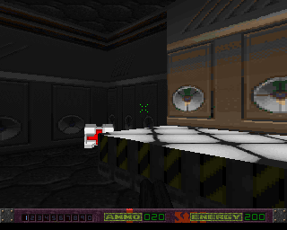
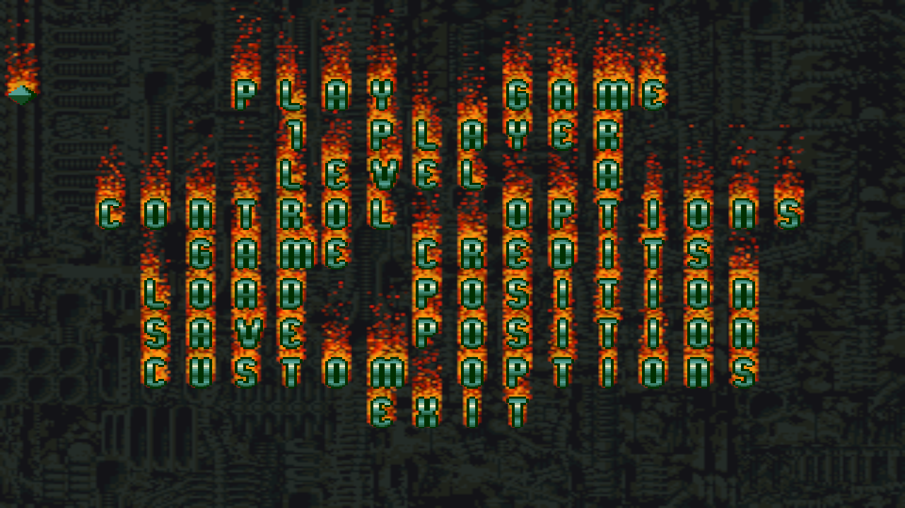

# Alien Breed 3D II : The Killing Grounds — Portage Java

Portage **Java fidèle** du moteur d'*Alien Breed 3D II : The Killing Grounds* (Team17, Amiga,
1996), depuis l'assembleur 68k et le C d'origine. Réécriture **ligne à ligne**, sans émulateur,
exécutée en natif sur PC via LWJGL 3.

> Porté par **Guillaume Monet**, avec l'assistance de Claude.

| Moteur d'origine (`gradle run`) | Remake full 3D (`gradle rebirth`) |
| --- | --- |
|  |  |

*La même salle du niveau A, rendue par les deux moteurs. À gauche le rasteriseur d'origine en
320×256 ; à droite le même niveau, la même simulation, sur jMonkeyEngine — un chantier en cours,
cf. §2.*

---

## 1. Principe

Le moteur d'origine est écrit en assembleur 68000/68020/68060 et en C, et cible le matériel
Amiga (puces custom, blitter, copper, audio Paula, conversion chunky→planar « C2P »). Ce projet
le réécrit **ligne à ligne** en Java, sans approximation :

- **Mémoire plate big-endian** — un unique `byte[] Mem.RAM` (64 Mo) émule la RAM 68k. Tous les
  accès passent par des helpers typés (`Mem.b/w/l`, `Mem.ub/uw`, `Mem.wb/ww/wl`…) qui
  reproduisent l'ordre des octets et l'arithmétique du 68k. Registres `d0-d7`/`a0-a6` → `int`.
- **Helpers 68k** — `M68k` (`swap`, `muls/mulu`, `divs/divu`, `asrw`, extensions de signe…)
  reproduit les idiomes du CPU, y compris ses pièges : `divs.w` renvoie `(reste << 16) | quotient`,
  et oublier le reste a déjà coûté un bug d'IA entier.
- **Cible 68060 + RTG** — on ne porte que la branche du processeur le plus rapide et l'affichage
  *chunky*. Les variantes CPU/résolution et la **conversion C2P sont volontairement exclues** :
  le moteur rend directement dans un tampon chunky présenté par l'hôte.
- **Couche hôte LWJGL 3** (GLFW / OpenGL / OpenAL) — remplace les puces custom Amiga pour
  l'affichage, la boucle de jeu, l'entrée clavier/souris et l'audio.
- **Deux moteurs, une seule simulation** — voir §2.

### Fonctionnalités portées

- Rendu 3D temps réel des niveaux (murs texturés, sols/plafonds, éclairage, gouraud).
- Objets/sprites, aliens et leur IA, armes et tir, ramassages, portes/ascenseurs/interrupteurs.
- HUD texturé, messages en jeu, carte automatique.
- Audio : musique (ProTracker) + effets sonores (mixage logiciel façon Paula).
- **Menu complet** : écran de feu animé, navigation, sous-menus options/contrôles, save/load,
  sliders/cyclers, persistance des préférences.
- **Texte narratif d'intro** de chaque niveau (police proportionnelle, rendu fidèle).
- Transition de téléport + musique de fin de niveau.

### Limitations connues

- **Mode 2 joueurs** non disponible (le lien série Amiga n'est pas porté ; un mode TCP local est
  prévu — voir §8).
- Plateforme de développement : **Windows x64** (natives LWJGL `natives-windows`).

---

## 2. Les deux moteurs

Les deux vivent dans le **même arbre source** et le **même build**. Ils partagent la simulation ;
seul l'affichage change.

```bash
gradle -p java run        # moteur 1 — le portage fidèle (défaut)
gradle -p java rebirth    # moteur 2 — le remake full 3D
```

### Moteur 1 — `ab3d2.host` : le rasteriseur d'origine

La traduction littérale. C'est lui **l'oracle** : quand un comportement du remake est douteux,
c'est contre celui-ci qu'on tranche, en instrumentant les deux et en comparant les traces.

### Moteur 2 — `ab3d2.rebirth` : le remake jMonkeyEngine

> ⚠️ **Rebirth est très loin d'être fini.** C'est un chantier en cours, pas une version jouable
> de bout en bout : il reste des bugs de rendu, de géométrie et de gameplay, tout n'est pas
> porté, et le résultat peut diverger du jeu d'origine sans prévenir. Le moteur 1 est la seule
> version fidèle et complète — c'est lui le défaut. Rebirth est fourni pour ce qu'il est : une
> exploration.

Vraie 3D, éclairage par lampes, ombres portées, bloom, visée verticale réelle. Il ne rejoue pas
le rasteriseur : il reconstruit la géométrie des niveaux et rejoue **la même logique de jeu**
(collision, tir, IA, portes), portée dans `rebirth/sim`.



*Le menu d'origine — fond qui défile, texte qui brûle — reporté à l'identique dans le remake.
Le feu est un portage littéral des trois blits Amiga `D = A_décalé | (B & C)`, où `A` est un plan
de la police : c'est le texte lui-même qui alimente les flammes.*

Le remake sait aussi rendre des choses que l'original ne pouvait pas :


*Niveau C, zone 117. Le jeu empile deux planchers dans un même secteur : une zone porte **deux**
flux de géométrie, l'un pour le bas, l'autre pour le haut. L'extraction ne lisait que le premier
et tout l'étage supérieur manquait — ici la passerelle au-dessus de l'escalier.*

---

## 3. Les données : les disquettes, et rien d'autre

**Aucun asset du jeu n'est versionné ici**, et le build redistribuable n'en embarque aucun non
plus. La seule source est le jeu de cinq images `.adf`, dans un dossier `adf/`.

Si elles manquent, le jeu **propose de les télécharger** depuis [Dream17](https://dream17.abime.net),
le site de préservation du catalogue Amiga de Team17 (archive ZIP d'environ 3,4 Mo). Rien n'est
téléchargé sans un oui explicite. Puis il monte les disquettes, dépacke ce qui doit l'être et
écrit un cache ; ensuite il lit ce cache.

```bash
gradle -p java fetchDisks    # récupérer les disquettes à la main
```

`-Dab3d2.adfUrl=…` change la source, `-Dab3d2.noDownload` désactive la proposition.

```
ab3d2-tkg-new/
├── ab3d2-tkg/        sources ASM/C d'origine (dépôt mheyer32/alienbreed3d2)
├── adf/              les cinq disquettes — LA source des assets
├── medias/original/  cache d'extraction (regénéré, jamais versionné)
└── ab3d2-tkg-java/
    ├── assets/       assets modernes produits par `extract` (regénérables)
    └── java/         ← CE DÉPÔT
```

### Le format `=SB=`

Les fichiers des disquettes sont compressés. `io_LoadFile` (`modules/file_io.s`) branche sur le
magic `'=SB='` et appelle `unLHA`, qui n'est qu'un `incbin "decomp4.raw"` — 2508 octets de 68k,
le même blob que celui embarqué dans l'outil `SBDepack` de 1997.

| offset | taille | contenu |
| --- | --- | --- |
| 0 | 4 | magic `=SB=` (`$3D53423D`) |
| 4 | 4 | taille **dépackée** |
| 8 | 4 | taille **packée** |
| 12 | … | flux compressé |

Les chaînes de `SBDepack` annoncent « *Decrunch algorithm by Team 17* », ce qui m'a d'abord fait
chercher un format maison. C'est faux : le désassemblage de `decomp4.raw` montre la séquence
exacte de `huf.c`,

```
07d4: moveq #$13,d1 ; moveq #$5,d0 ; moveq #$3,d2 ; bsr $344   -> read_pt_len(NT=19, TBIT=5, 3)
07de: bsr $4f0                                                 -> read_c_len()
07e2: move.w np,d1 ; moveq #$4,d0 ; cmp.w #$10,d1 ; blt ; addq #1,d0
07f2: bsr $344                                                 -> read_pt_len(np, pbit, -1)
```

soit du **LHA**. Le blob porte deux points d'entrée qui ne diffèrent que par `np` :

```
01a0: move.w #$1fe,NC ; move.w #$e ,np    ; np=14 -> dicbit 13 (-lh5-)
01b0: move.w #$1fe,NC ; move.w #$10,np    ; np=16 -> dicbit 15 (-lh6-)
```

et le jeu appelle **le second**. C'est du `-lh6-`, fenêtre de 32 Ko — décodé en `-lh5-` le flux
part en vrille dès le premier bloc, ce qui est exactement ce qui m'avait égaré.

Porté dans `host/SbDepack.java`, avec `host/Adf.java` (lecture OFS/FFS) et `host/AdfAssets.java`
(montage). **Validation** : 430 fichiers sur les disquettes, 313 packés, **313 décodés sans
erreur**, zéro écart de contenu avec un corpus dépacké de référence.

```bash
gradle -p java adfCheck    # valide le dépacking (doit afficher PASS)
gradle -p java depack      # force la reconstruction du cache
```

### Quelles disquettes

On cible la version **4 Mo**, donc trois disquettes suffisent : **3** (boot 4 Mo), **2**
(niveaux A–P) et **5** (sons). La 1 est le boot 2 Mo — ses variantes sont différentes et plus
pauvres — et la 4 est l'éditeur. L'ordre de montage compte : AmigaDOS ignorant la casse,
`/includes` et `/Includes` sont **le même** répertoire, et sans cette fusion la variante 4 Mo
n'écrase pas la 2 Mo.

### Les `incbin`

Vingt et un des vingt-deux `incbin` du moteur ne sont sur **aucune** disquette et ne sont
référencés nulle part dans `test.lnk` (la base GLF) : tables du rasteriseur (`bigsine`,
`iterfile`, `guff`, `waterfile`, `shimmerfile`), polices et chiffres, bordure d'écran, écran de
menu, et les deux modules ProTracker de fin. C'est normal — l'assembleur les incorporait **au
binaire**, ils n'ont jamais été livrés en fichiers. Ils font donc partie du *programme*, pas des
données du jeu, et sont versionnés ici sous `resources/incbin/` (300 Ko).

Seul `256pal` vient des disquettes ; `includes/newtitlepal` n'existe nulle part et reste absent.

---

## 4. Prérequis

| Composant | Version |
| --- | --- |
| **JDK** | 21 (toolchain Gradle configurée sur Java 21) |
| **Gradle** | 9.x |
| **OS** | Windows x64 (natives LWJGL `natives-windows`) |
| **GPU** | OpenGL |
| **Données** | les cinq `.adf` du jeu, dans un dossier `adf/` |

Les dépendances (LWJGL, jMonkeyEngine, gson) sont récupérées depuis Maven Central au premier build.

---

## 5. Structure du projet

```
java/                       ← racine du dépôt
├── README.md
├── build.gradle            build + tâches des deux moteurs
├── docs/                   architecture et notes de portage (PORT_SUBSYS_*, PVS.md)
├── resources/
│   ├── Shaders/            shaders du moteur rebirth
│   └── incbin/             les incbin liés au binaire d'origine (cf. §3)
├── run/                    généré à l'exécution (préférences, sauvegardes, journal)
└── src/ab3d2/
    ├── *.java              cœur du moteur (Hires, Controlloop, Plr*control, Objdraw…)
    ├── c/                  portage des fichiers C (ScreenC, DrawC, MenuC, GameC…)
    ├── modules/            sous-systèmes (Player, Res, FileIo, RawKeyMacros…)
    ├── data/               sections de données initialisées (tables, polices, menus)
    ├── bss/                sections BSS (buffers, KeyMap…)
    ├── menu/               moteur de menu (Menunb)
    ├── host/               MOTEUR 1 — rendu d'origine, couche LWJGL, lecture des disquettes
    ├── rebirth/            MOTEUR 2 — remake jMonkeyEngine
    │   ├── sim/            simulation partagée (collision, tir, IA) + harnais headless
    │   ├── menu/           menu et options du remake
    │   └── extract/        extraction des assets d'origine vers PNG/JSON/OBJ
    └── tools/              outillage (CheckLayout, AdfCheck, Depack, SkyDump)
```

---

## 6. Compilation & exécution

```bash
gradle -p java run                      # moteur 1 : le portage fidèle
gradle -p java rebirth                  # moteur 2 : le remake jME
gradle -p java rebirth -Plevel=c        # un autre niveau
gradle -p java extract                  # (re)fabrique les assets modernes du remake
gradle -p java compileJava
```

### Build redistribuable (Windows)

Produit une **app-image portable** : un dossier autonome avec l'exécutable et un **JRE
embarqué**, et *sans aucune donnée du jeu*.

```bash
gradle -p java packageApp
```

Résultat : `java/build/jpackage/AlienBreed3D2-TKG/` — lancer `AlienBreed3D2-TKG.exe`. Le dossier
est déplaçable : les chemins sont résolus relativement à l'exécutable.

```
AlienBreed3D2-TKG/
├── AlienBreed3D2-TKG.exe
├── LISEZMOI.txt
├── adf/        les disquettes (vide au départ)
├── app/        les jars
├── run/        réglages et sauvegardes
└── runtime/    le JRE embarqué
```

Au **premier lancement**, le jeu constate que les données manquent et propose de télécharger les
disquettes ; il les dépacke ensuite tout seul dans `medias/`. Comme rien de Team17 n'est
redistribué, le paquet peut circuler tel quel.

### Diagnostic (gel / logs)

L'app-image est sans console : `Main` redirige `stdout`/`stderr` vers `<App>/run/ab3d2.log`. En
cas de gel, un *watchdog* écrit la pile de tous les threads après 5 s sans frame (chercher
`"main"`).

- `-Dab3d2.watchdogMs=N` — seuil (`0` désactive) ; `-Dab3d2.log=chemin` (`off` garde la console).
- `-Dab3d2.assets=…` force la racine des assets, `-Dab3d2.adf=…` le dossier des disquettes.

### Vérifier l'intégrité du portage

```bash
gradle -p java checkLayout    # disposition mémoire — doit afficher « TOUT OK »
gradle -p java adfCheck       # dépacking des disquettes — doit afficher PASS
gradle -p java moveTest shotTest alienTest [-Plevel=c]   # simulation, headless
```

---

## 7. Contrôles

### Moteur 1 (remappables dans le menu Options › Contrôles)

| Touche | Action |
| --- | --- |
| `W` / `S` | Avancer / Reculer |
| `←` / `→` | Tourner à gauche / droite |
| `A` / `D` | Pas de côté gauche / droite |
| `Ctrl` | Tirer |
| `F` | Actionner (portes, interrupteurs) |
| `Shift` gauche | Courir |
| `Alt` gauche | Forcer le pas de côté |
| `C` / `Espace` | S'accroupir / Sauter |
| `=` / `-` / `;` | Regarder haut / bas / recentrer |
| `L` | Regarder derrière |
| `\` , `1`…`9`,`0` | Arme suivante, sélection directe |
| `Échap` / `P` / `Tab` | Quitter le niveau / Pause / Carte |
| `F7` / `F10` | Limite de FPS / Plein écran |

> Le mapping clavier est **physique** (`W` de l'hôte → `RAWKEY_W`) ; les bindings de jeu sont
> appliqués sur ces rawkeys par le moteur, exactement comme sur Amiga.

### Moteur 2

`ZQSD`/`WASD` bouger, souris regarder, `Maj` courir, `Espace` sauter/jetpack, `C` s'accroupir,
`E` actionner, clic tirer, `1`…`0`/`X` armes, `Tab` carte, `Échap` menu. Tout est remappable dans
le menu Options du remake.

---

## 8. Avancement

| Sous-système | Statut |
| --- | --- |
| Infra `Mem` / `M68k` / `Assets` | ✅ `gradle checkLayout` « TOUT OK » |
| Rendu : murs, sols/plafonds, gouraud, PVS | ✅ `gradle levelTest` |
| Objets, sprites, modèles vectoriels | ✅ |
| Aliens : IA, animations, ligne de vue, dégâts | ✅ `gradle alienTest` |
| Joueur : déplacement, collision, capacités | ✅ `gradle moveTest` |
| Armes, tir, projectiles, impacts | ✅ `gradle shotTest` |
| Portes, ascenseurs, interrupteurs | ✅ |
| HUD, messages, carte automatique | ✅ |
| Menu complet + préférences persistées | ✅ `gradle menuTest` |
| Textes d'intro et de fin | ✅ |
| Audio : ProTracker + effets façon Paula | ✅ |
| Build redistribuable (app-image jpackage) | ✅ `gradle packageApp` |
| Dépacking `=SB=` + lecture des disquettes | ✅ `gradle adfCheck` — 313/313 |
| Rebirth : géométrie, textures, éclairage, ombres | 🚧 en chantier |
| Rebirth : simulation partagée (collision, tir, IA) | 🚧 `moveTest`/`shotTest`/`alienTest` passent, le jeu reste incomplet |
| Rebirth : menu, options, save/load, carte | 🚧 en chantier |
| Mode 2 joueurs (TCP local, remplace le lien série) | ⏳ |
| Chargement des sauvegardes par niveau (`DEFGAME`) | ⏳ |
| Portage Linux/macOS (natives LWJGL) | ⏳ |

---

## 9. Notes d'architecture

- **`Mem`** : mémoire 68k émulée (tableau plat big-endian) + helpers d'initialisation des
  sections data/bss (`dcB/dcW/dcL/dcStr/incbin/alloc/align`).
- **Affichage** : le moteur rend dans `Vid_FastBufferPtr_l` (cible chunky). `ScreenC.Vid_Present`
  compose le HUD et présente l'image ; `host/Display` pousse le tampon ARGB via OpenGL.
- **Entrée** : `host/Input` traduit les évènements GLFW en rawkeys Amiga écrits dans `KeyMap_vb`,
  que lisent les routines de contrôle (`Plr*control` → `modules/Player`).
- **Audio** : mixage logiciel des canaux façon Paula, sortie OpenAL.
- **Fichiers** : `modules/FileIo` + `host/DosLib` réimplémentent les I/O AmigaDOS ; les écritures
  (préférences, sauvegardes) vont dans `run/`.

La documentation détaillée par sous-système est dans `docs/` (`ARCHITECTURE.md`,
`PORT_SUBSYS_01..20.md`, `PVS.md`).

### Méthode

Une règle a gouverné tout le projet : **porter l'ASM littéralement, jamais approximer**. Quand un
comportement diverge, on n'argumente pas — on **instrumente les deux moteurs et on compare les
traces**. Quelques exemples de ce que cette méthode a débusqué :

- Les aliens se regroupaient tous au même endroit : `divs.w` renvoie `(reste << 16) | quotient`
  et le reste était jeté, donc chaque monstre tirait « au hasard » le point de contrôle 0.
- Les monstres devenaient increvables : le jeu tient **deux** compteurs de dégâts distincts, le
  cumul permanent (`AI_Damaged_vw`) et un champ du workspace de ronde que `ai_ProwlFly` remet à
  zéro **à chaque frame**. Les confondre ne laissait mourir que ceux qui encaissaient quatre fois
  leurs points de vie en une seule frame.
- Les portes n'étaient pas des volumes : `DoorRoutine` écrit la position du battant dans le flat
  de plafond de sa zone, et ce dessous-là ne bougeait pas.
- Les escaliers superposés du niveau C manquaient : une zone porte **deux** flux de géométrie,
  l'extracteur n'en lisait qu'un.

---

## 10. Licence & crédits

*Alien Breed 3D II : The Killing Grounds* et ses données sont la propriété de **Team17**. Ce
projet est un portage **non commercial** à but d'étude et de préservation. Les assets du jeu ne
sont **pas** redistribués avec ce dépôt : il faut posséder le jeu et fournir ses disquettes.

Moteur d'origine : Team17 (Andy Clitheroe et al.). Sources ASM/C de référence :
[mheyer32/alienbreed3d2](https://github.com/mheyer32/alienbreed3d2). Portage Java :
**Guillaume Monet**.
